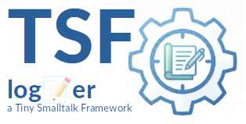

|<sub>🇬🇧 [English translation →](README.en.md)</sub>|
|----:|
|    |

|[](https://pharo.org)|[](./LICENSE) [](#)|
|----|----|
|| ***TSF-Logger***<br>Ein leichtgewichtiges, performantes Logging-Framework für Pharo Smalltalk. Teil der **Tiny Smalltalk Framework Suite**|

<sup>***TSF*** steht für ***Tiny Smalltalk Framework*** — eine Sammlung von minimalistischen Tools für robuste Anwendungen.</sup>


## Überblick

Der **TSF-Logger** ist ein einfacher, leichtgewichtiger und sofort einsatzbereiter Logger mit Log-Level Support. Er folgt einem modularen Ansatz basierend auf dem Strategy- und Decorator-Pattern.

**Hauptmerkmale:**
* **Tiny:** Minimaler Code-Footprint, keine externen Abhängigkeiten.
* **High-Speed:** Block-Support für Lazy-Evaluation, Async-Logging Support.
* **Robust:** "Open-Write-Close" Strategie für File-Appender (kompatibel mit externer Log-Rotation).
* **Einfach:** "Convention over Configuration" – `TsfLogger new` ist sofort einsatzbereit.

## Installation

```smalltalk
Metacello new
    baseline: 'TsfLogger';
    repository: 'github://georghagn/TSF-Logger';
    load.
````

## Quick Start

```smalltalk
| log |
log := TsfLogger new. "Standard: Schreibt in den Transcript"

log info: 'System gestartet'.
log warn: [ 'Achtung, Wert ist: ', expensiveCalculation printString ]. "Lazy Evaluation"
```

## Features & Konfiguration

### Logger Instanziierung

```smalltalk
"Einfach (Transcript)"
log := TsfLogger new.

"Benutzerdefiniert (Datei + JSON)"
fileAppender := TsfFileAppender newOn: (FileSystem disk workingDirectory / 'app.json').
fileAppender formatter: TsfJsonLogFormatter new.

log := TsfLogger new
    clearAppenders;
    addAppender: fileAppender;
    yourself.

log addAppender: TsfTranscriptAppender new.
log info: 'Datei (Json) und Transcript (Plain) Logger'.
```

### Async Logging (High Performance)

Für kritische Performance-Pfade kann jeder Appender in einen asynchronen Worker gewrappt werden. Der Main-Thread wird dadurch nicht blockiert.

```smalltalk
fastAppender := TsfAsyncLogAppender decorate: (TsfFileAppender newOn: 'server.log' asFileReference).
log addAppender: fastAppender.

"Wichtig beim Beenden:"
fastAppender flush. 
```

### Log Levels

Verfügbar sind: `debug`, `info`, `warn`, `error`, `fatal`.
Das Level kann zur Laufzeit geändert werden:

```smalltalk
log level: #ERROR. "Ignoriert alles unterhalb von Error"
```

    
## Entwicklungsprozess & Credits

Ein besonderer Dank gilt meinem KI-Sparringspartner für die intensiven und wertvollen Diskussionen während der Entwurfsphase. Die Fähigkeit der KI, verschiedene Architekturansätze schnell zu skizzieren und Vor- und Nachteile abzuwägen, hat die Entwicklung von `TSF-Logger` erheblich beschleunigt und die Robustheit des Endergebnisses verbessert.

## License

Dieses Projekt steht unter der Apache 2.0 Lizenz. Siehe LICENSE.


## Kontakt

Bei Fragen oder Interesse an diesem Projekt erreichen Sie mich unter:   
📧 *dev.georgh [at] hconsult.biz*

<sup>*(Bitte keine Anfragen an die privaten GitHub-Account-Adressen)*</sup>
